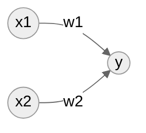
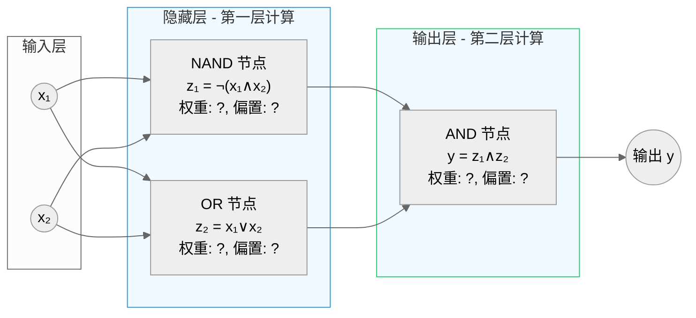

## 1. 感知机 

**感知机** perceptron 算法是由 Frank Rosenblatt 于 1957 年首次提出，是神经网络的起源算法，感知机接收多个输入信号并输出一个信号，信号的取值为 `0` 和 `1`，下图展示了两个输入和一个输出的感知机， $w_1$ 和 $w_2$ 分别是两个输入 $x_1$ 和 $x_2$ 的**权重**。

神经元会计算输入信号的加权总和，当加权和超过某个界限值（称为**阈值**） $\theta$ 时，神经元被激活。

$$
y = \begin{cases}
0,& w_1x_1+w_2x_2 \leqslant \theta \\
1,& w_1x_1+w_2x_2 > \theta
\end{cases}
$$

感知机的每个输入都对应有一个权重，权重越大对应权重的信号就越重要；我们将阈值 $\theta$ 移动到条件等式的左侧，得到**偏置** $b=-\theta$ ，偏置是调整神经元被激活的容易程度的参数。

$$
y = \begin{cases}
0,& b+w_1x_1+w_2x_2 \leqslant 0 \\
1,& b+w_1x_1+w_2x_2 > 0
\end{cases}
$$

利用单层感知机，我们可以很容易实现：

- 与门 AND gate
- 与非门 NAND (Not AND) gate 
- 或门 OR gate

不过单层感知机只能分割线性空间，无法分割非线性空间，这是因为条件形如 $b+w_1x_1+w_2x_2$ 的条件等式是一个线性方程。想象一下异或门 XOR gate 它在输入信号都是 `0` 或 `1` 的时候输出 `0`，在一个输入为 `0`，另外一个输入为 `1` 时输出为`1`，想象一下这个二维空间上的点，我们是无法通过一个直线将它们分割开。不过感知机的神奇之处可以通过叠加多层感知机来实现非线性空间，我们也称为**多层感知机** multi-layered perceptron

单层感知机只能表示线性空间，而多层感知机可以表示非线性空间。

### 神经网络

