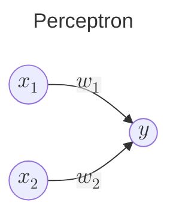
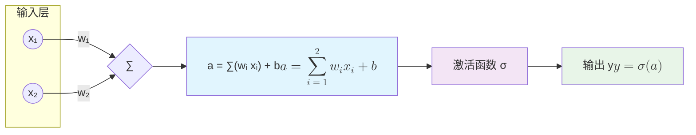

## 1. 感知机 

**感知机** perceptron 算法是由 Frank Rosenblatt 于 1957 年首次提出，是神经网络的起源算法，感知机接收多个输入信号并输出一个信号，信号的取值为 `0` 和 `1`。

1957 年 Frank Rosenblatt 首次提出了感知机 **perceptron** 算法，是神经网络的起源算法。感知机接收多个输入信号，输出一个信号，信号的取值为 `0` 和 `1`，分别表示不传递和传递信号，下图展示了两个输入和一个输出的感知机示例，$w_1$和$w_2$是权重。

当信号综合超过某个界限值 $\theta$，称为阈值时，神经元被激活

$$
y = \begin{cases}
0,& b+w_1x_1+w_2x_2 \leqslant \theta \\
1,& b+w_1x_1+w_2x_2 > \theta
\end{cases}
$$

感知机的每个输入都对应有一个权重，权重越大对应该权重的信号就越重要。

- 与门 AND gate
- 与非门 NAND gate, Not AND
- 或门 OR gate

修改表现形式，将 $\theta$ 移动到不等式的左边，并令 $b=-\theta$，通常我们将b称为偏置，w_1he w_2称为权重。

权重是控制输入信号重要程度的参数，偏置是调整神经元被激活的容易程度的参数。有时候也会把偏置和权重统称为权重。

$$
y = \begin{cases}
1,& b+w_1x_1+w_2x_2 > 0\\
0,& b+w_1x_1+w_2x_2 \leqslant 0
\end{cases} \tag{1}
$$

感知机的局限性
单个感知机只能分割线性空间，而无法分割非线性空间
形如 $\displaystyle \sum_{i=1}{x_iw_i} + b$ 是一个线性方程，只能将空间分割为线性空间，因此无法表示像异或门这样的结构。异或门

虽然无法通过单个感知机实现非线性空间，但是可以通过叠加多层感知机实现
第一层由与非门和或门组成，第二层则由与门组成，两层感知机实现了异或门结构。

叠加了多层的感知机也称为多层感知机**multi-layered perceptron**

通过实现的异或门我们可以发现，叠加多层的感知机能够实现非线性空间。

感知机的局限性就在于它只能表示由一条直线分割的空间。图 2-8 这样弯 曲的曲线无法用感知机表示。另外，由图 2-8 这样的曲线分割而成的空间称为 非线性空间，由直线分割而成的空间称为线性空间。线性、非线性这两个术 语在机器学习领域很常见，可以将其想象成图 2-6 和图 2-8 所示的直线和曲线。

感知机是具有输入和输出的算法。给定一个输入后，将输出一个既 定的值。
• 感知机将权重和偏置设定为参数。
• 使用感知机可以表示与门和或门等逻辑电路。
• 异或门无法通过单层感知机来表示。
• 使用2层感知机可以表示异或门。
• 单层感知机只能表示线性空间，而多层感知机可以表示非线性空间。
• 多层感知机(在理论上)可以表示计算机。

### 神经网络

